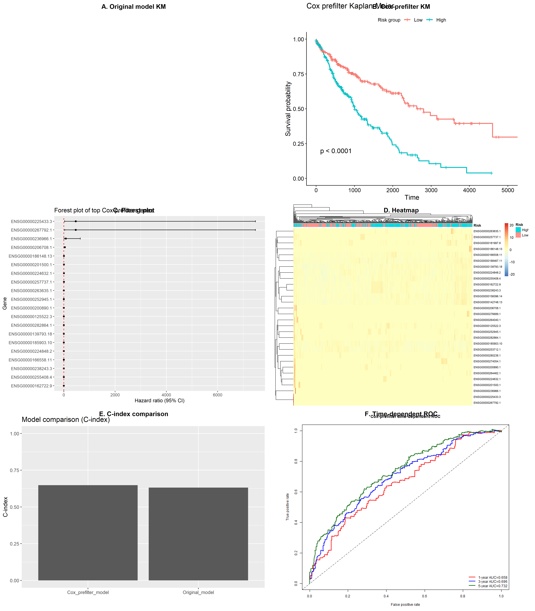
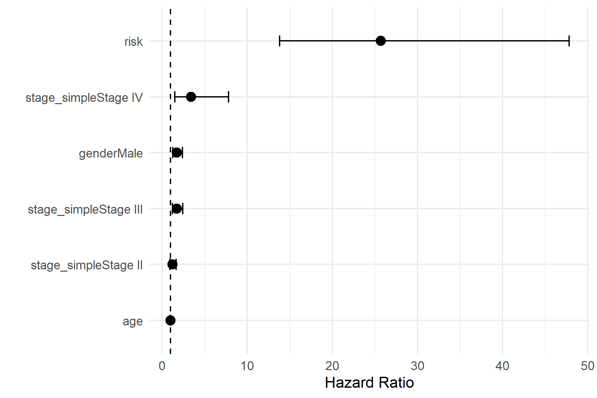
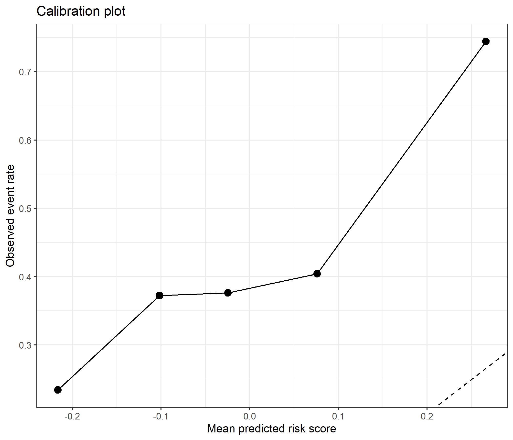
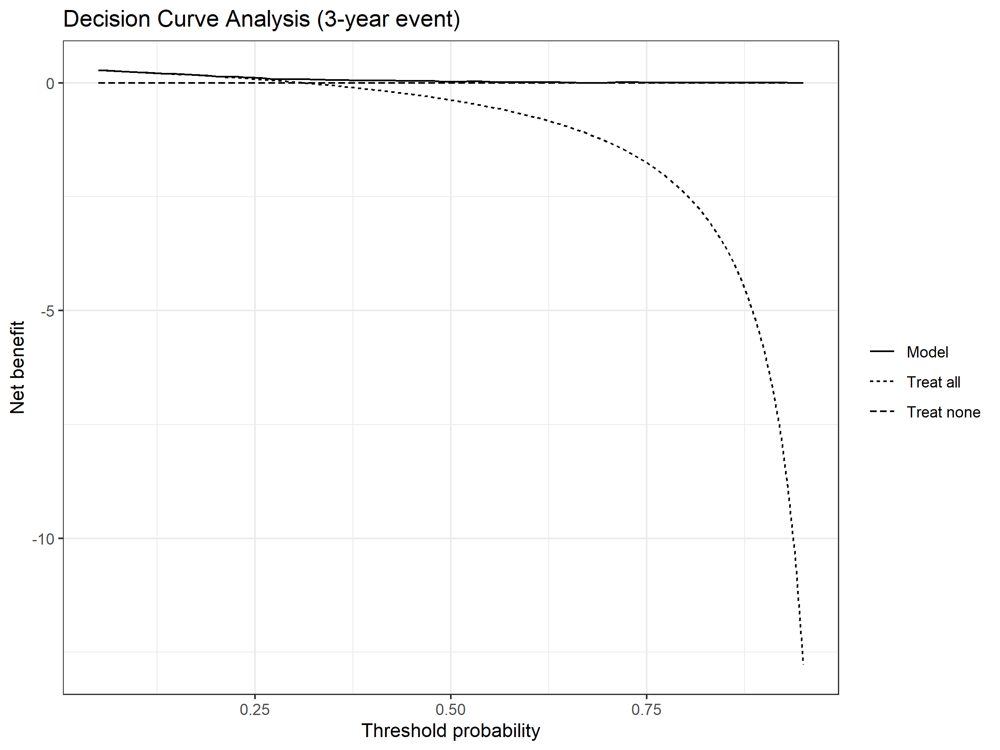

# Transcriptome-based prognostic signature for lung squamous cell carcinoma

## Study overview

The workflow and main analytical results are summarized below.

## Key results

### Model performance

### Multivariable Cox regression

### Calibration

### Decision curve analysis

## Overview

This repository contains the analysis pipeline and results for the study:

**Development and validation of a transcriptome-based prognostic signature for survival prediction in lung squamous cell carcinoma (LUSC).**

The study develops and evaluates transcriptomic survival prediction models using TCGA-LUSC data and external validation cohorts from GEO.

The analysis includes:

- Elastic-net Cox survival modeling
- Cox-prefilter feature selection
- Kaplan–Meier survival analysis
- Time-dependent ROC analysis
- Multivariable Cox regression
- Calibration analysis
- Decision curve analysis
- External validation in GEO cohorts

---

# Study design

The workflow used in this study is illustrated below.

Training and test cohorts were derived from TCGA-LUSC transcriptomic and clinical datasets.

Two modeling strategies were evaluated:

1. Elastic-net Cox model
2. Cox-prefilter transcriptomic signature

Model performance was assessed using survival analysis and external validation.

---

# Data sources

The study uses publicly available datasets:

### TCGA

The Cancer Genome Atlas (TCGA-LUSC)

- transcriptomic RNA-seq data
- clinical survival data

### GEO external validation

- GSE30219
- GSE37745

These datasets were used to assess the reproducibility of the prognostic signature.

---

# Repository structure

data/
processed clinical and expression data

scripts/
R scripts used for analysis

results/
figures, tables and model outputs

manuscript/
manuscript text and submission files

---

# Main analyses

The analysis pipeline includes the following steps:

1. Data preprocessing and matching of transcriptomic and clinical data
2. Train/test cohort generation
3. Elastic-net Cox survival modeling
4. Cox-prefilter gene selection
5. Kaplan–Meier survival analysis
6. Time-dependent ROC analysis
7. Multivariable Cox regression
8. Calibration analysis
9. Decision curve analysis
10. External validation in GEO cohorts

---

# Key results

The Cox-prefilter transcriptomic model demonstrated improved prognostic performance compared with the original elastic-net model.

Key findings include:

- Improved hazard ratio between high- and low-risk groups
- Concordance index improvement
- Independent prognostic value in multivariable analysis
- External validation in GEO cohorts

---

# Figures

Key figures generated in this study include:

- Kaplan–Meier survival curves
- Time-dependent ROC curves
- Multivariable Cox regression forest plot
- Calibration plot
- Decision curve analysis
- External validation survival curves

All figures are available in:

results/

---

# Reproducibility

The repository includes all scripts required to reproduce the analysis pipeline.

The R environment used for the analysis is documented in:

sessionInfo.txt

---

# Requirements

R version used:
R 4.5.2

Main R packages:

survival
survminer
glmnet
timeROC
clusterProfiler
GEOquery
ggplot2

---

# Citation

If you use this code or analysis framework, please cite:

Development and validation of a transcriptome-based prognostic signature for survival prediction in lung squamous cell carcinoma.

---

# Data availability

Code and processed data used in this study are available in this repository.

Public datasets used in the study:

TCGA-LUSC  
https://portal.gdc.cancer.gov/

GEO datasets  
https://www.ncbi.nlm.nih.gov/geo/

---

# License

This repository is released under the MIT License.

---

# Contact
Agata Gabara

